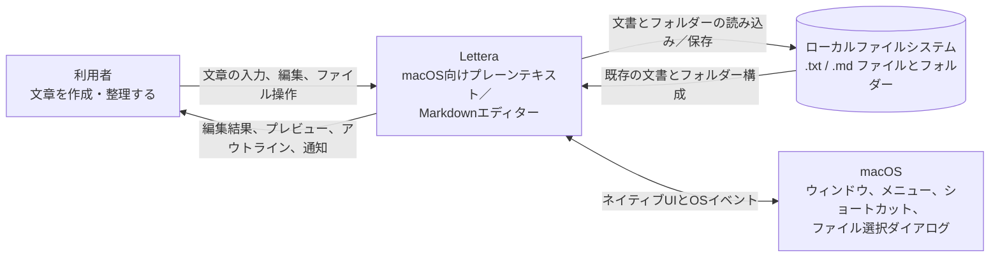

# アーキテクチャ

## 状態

この文書は現在の構成を表すliving documentである。コードの責務やデータの流れを変更した場合は、同じ変更内で更新する。

現在はPhase 2のMarkdownプレビューまで完了している。Reactのstateで本文とSource／Splitの表示モードを保持し、controlled textareaとしてSource editorを表示する。Splitでは同じ本文からReact内でMarkdownプレビューを導出する。Tauri初期テンプレートのサンプルUIと`greet` Commandは削除しており、Rust Commandはまだ持たない。以下の境界は目標とする構成を含む。存在しないレイヤーや抽象化を、文書に合わせるためだけに先行実装しない。

## システムコンテキスト



Letteraのシステム境界はデスクトップアプリ全体である。アカウント、クラウドサービス、独自データベースを主要機能の前提にせず、文書の正本は利用者が所有するローカルファイルに置く。図の矢印は初期版で目指す関係を表し、現在すべてが実装済みであることは意味しない。

## 全体構成

```text
利用者
  │ 操作・表示
  ▼
React UI (`src/`)
  │ 文書操作
  ▼
Document state / use cases (`src/`、必要になった時点で分離)
  │ native operation request
  ▼
Tauri invoke boundary
  │ 検証済みの要求
  ▼
Rust native operations (`src-tauri/src/`)
  │
  ▼
ローカルのプレーンテキスト／Markdownファイル
```

## 責務

### React UI

担当すること：

- エディタ、プレビュー、ツールバー、サイドバーなどの表示
- 利用者の入力と操作の受付
- 文書状態に基づく画面更新
- ネイティブ操作の開始と、結果またはエラーの表示

担当しないこと：

- OSのファイルを直接読み書きすること
- ファイルパスが安全だと判断すること
- UIコンポーネント内へ永続化処理の詳細を埋め込むこと

### Document state / use cases

必要になった時点でReactコンポーネントから分離する。最初から専用フレームワークや複雑な状態管理ライブラリを導入しない。

担当すること：

- 現在の本文、ファイルパス、未保存状態の関係
- 新規作成、読み込み結果の反映、保存完了などの文書操作
- Source／Split／Seamlessに共通する論理文書

### Markdown transformation

- Markdown本文からプレビューやアウトラインに必要な情報を導出する。
- 元のMarkdown本文を正本とし、レンダラー固有のモデルを保存形式にしない。
- Phase 2では既存の`textarea`をSource editorとして維持し、`react-markdown`と`remark-gfm`で同じ本文からプレビューを導出する。
- Phase 2のraw HTML、リンク、画像に関する安全な表示方針は、[Markdown preview仕様](features/002-markdown-preview.md)を正本とする。
- Markdown変換とSource／Splitの表示状態はReact内で扱い、Rust Commandを経由しない。
- MilkdownはPhase 2へ導入せず、将来Seamless editorへ着手するときにMarkdownの往復保持、日本語IME、カーソル位置、Undo履歴への影響を評価してから移行するか判断する。
- 将来のライブラリ移行だけを目的に、現在のPhaseで不要な抽象化を先行実装しない。

### Rust / Tauri native operations

担当すること：

- ファイルダイアログやファイルシステムなど、OS機能との接続
- フロントエンドから受け取った入力の検証
- 読み込み・保存の実行と、構造化された成功／失敗結果の返却
- Lettera固有の設定と最近使ったファイルの参照を、ユーザー文書とは別のアプリデータとして読み書きすること
- Tauri capabilityの必要最小限の設定

担当しないこと：

- Reactの表示状態を管理すること
- Markdownの見た目を決めること
- 利用者へ表示する文章を不必要にRust側へ固定すること

## データの正本

- 保存済み文書の正本はローカルファイルである。
- 編集中は、メモリ上のMarkdown本文が未保存の作業状態となる。
- プレビューとアウトラインはMarkdown本文から導出し、独立した正本にしない。
- Source／Split／Seamlessは同じ作業状態を共有する。
- 基本フォントサイズ、カラーモード、最近使ったファイルの参照はLettera固有のアプリデータであり、ユーザー文書へ混入させない。

## エラーの扱い

- Rust側は、呼び出し元が原因と対処を区別できるエラーを返す。
- React側は、エラーが起きても編集中の本文を保持する。
- 内部エラーをそのまま利用者へ露出せず、次に取れる操作を示す。
- 保存失敗時に、保存済みと表示したり未保存状態を解除したりしない。

## 現時点で未決定の事項

次の事項は、必要な機能へ着手するまで決定しない。

- エディタコンポーネントまたはエディタライブラリ
- Reactの状態管理方法（`useState`を超える仕組みが必要か）
- ファイルダイアログをTauri pluginと独自Commandのどちらで扱うか
- アプリ設定と最近使ったファイルを扱う具体的な保存ライブラリ、ファイル構造、スキーマ更新方法
- 保存の原子的な置換方法と、外部変更の検出方法
- Seamless編集の内部表現

重要な選択肢が複数あり、後続機能へ長期的に影響する判断だけをADRへ記録する。
