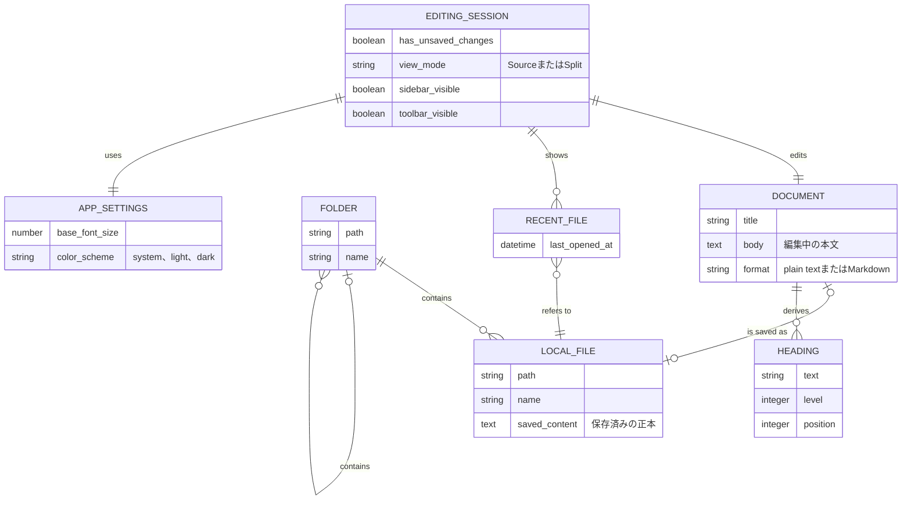

# 概念データモデル

## 目的と扱い

この文書は、Letteraが扱う主な概念と関係を共有するための補助資料である。初期版の機能を考え、後続の仕様作成や実装で見落としを減らすことを目的とする。

データベースのテーブル設計、永続化形式、正規化、識別子、データ型を決定するものではない。図中の属性は概念を理解するための代表例であり、実装時にそのまま保持することを要求しない。実装の進行に合わせて、不要な概念の削除や名称・関係の変更を行う。

## ER図

## 概念の補足

- **Document**は、Source／Splitのどちらからも参照する一つの論理文書である。新規文書は、保存されるまでLocal fileを持たない。
- **Editing session**は、起動中の作業状態を表す。本文を保存できるまでは未保存状態を維持し、保存失敗時もDocumentを失わない。
- 利用者はユースケース上のアクターであり、アカウントや利用者情報を保持しないため、このデータモデルのエンティティには含めない。
- **Local file**は保存済み文書の正本であり、Lettera以外のツールからも読み書きできるプレーンテキストまたはMarkdownファイルである。
- **Heading**はMarkdown本文から導出する概念であり、Documentとは別の正本にしない。プレビューも同様に本文から導出するため、独立したエンティティとして表していない。
- **Folder**はファイルツリーの起点と階層を表す。Letteraがフォルダー自体を所有することは意味しない。
- **Recent file**は、利用者が過去に開いたLocal fileを再度見つけるための参照である。参照先が移動または削除されている可能性を許容する必要がある。
- **App settings**は、文書とは独立したLettera全体の設定である。基本フォントサイズとカラーモードを保持し、起動中のEditing sessionへ適用する。

## 現段階で決めないこと

- 各概念をReact state、Rustの型、設定ファイルなどのどこへ配置するか
- 最近使ったファイルとApp settingsを保存する具体的なファイル構造、ファイル名、スキーマ更新方法
- ファイルとフォルダーを内部でどの識別子によって追跡するか
- 見出し、プレビュー、アウトラインで共有する解析結果の構造
- 複数ウィンドウ、複数タブ、外部ファイル変更へ対応するための関係

これらは対応する機能へ着手した段階で、実際の制約を踏まえてデータモデリングを行う。
