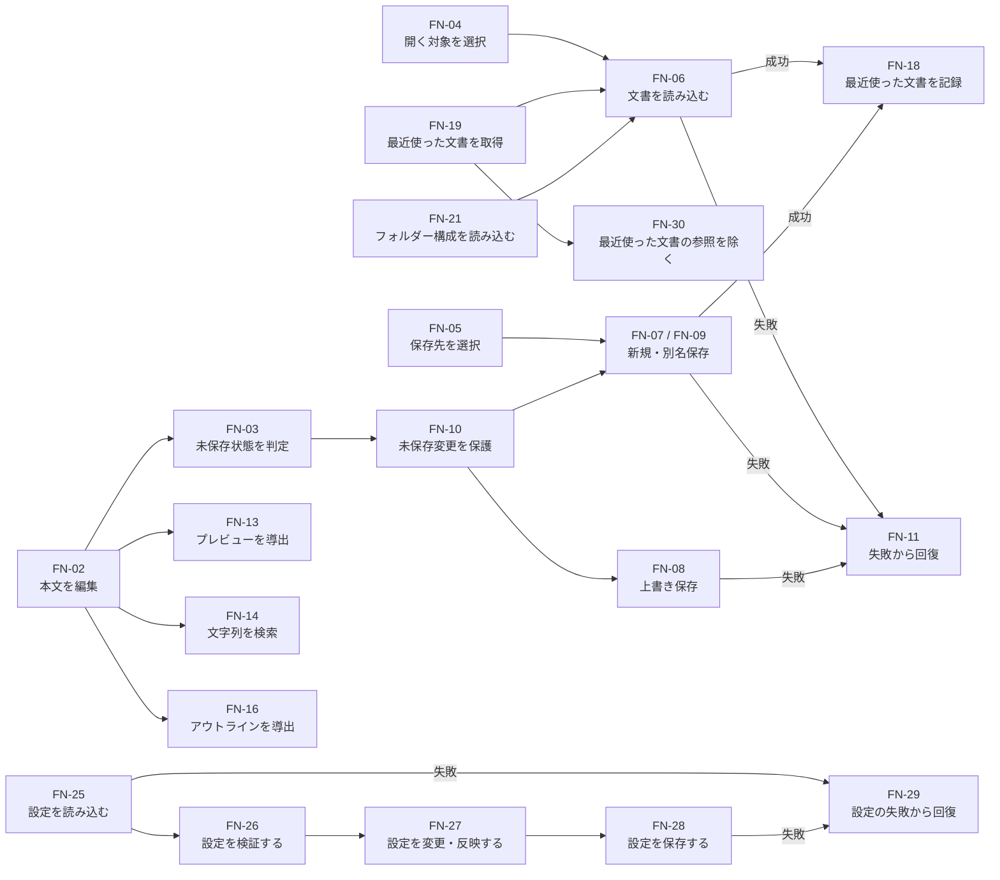

# 機能定義

## 状態

Draft

## 目的と扱い

この文書は、Letteraの初期版に必要な機能を、利用者の操作や外部からの入力に対して「何を処理し、何を出力するか」という観点で定義する。機能の抜けや重複を見つけ、後続のデータ検討と個別機能仕様の基準にすることを目的とする。

ここでいう機能は、コード上の関数、Reactコンポーネント、Tauri Command、Rustのモジュールと同じ単位ではない。一つの機能をどの技術要素へ配置するか、どのライブラリを使うか、内部APIをどう設計するかは決定しない。

利用者の目的と行動は[利用者の行動シナリオ](user-action-scenarios.md)、画面上の表現と動線は[UI設計](ui-design.md)、主要概念の見取り図は[概念データモデル](conceptual-data-model.md)、機能が扱うデータと制約は[論理データモデル](logical-data-model.md)、実装順は[開発ロードマップ](roadmap.md)を正本とする。

## 機能の考え方

- 利用者または外部環境から受け取るものを入力とする。
- 入力を受けてLetteraが行う判断または変換を処理とする。
- 利用者、UI、ローカルファイルシステム、macOSへ返すものを出力とする。
- 画面を表示するだけの項目ではなく、入力に対して結果を返す単位で機能を分ける。
- 保存や読み込みなど、状態を永続的に参照または変更する機能はストア系機能として区別する。
- 失敗によって利用者の既存ファイルや編集中の内容を失わせない。

## ワークセット一覧

ワークセットは、一つの利用目的を達成するために協調する機能のまとまりである。

| ID | ワークセット | 目的 | 関連シナリオ | 主なUI |
| --- | --- | --- | --- | --- |
| WS-01 | すぐに書く | 起動後、準備をせず文章を書き始める | AS-01 | UI-01 |
| WS-02 | 文書ライフサイクル | 文書を新規作成、開く、保存、閉じる | AS-02、AS-03、AS-04、AS-10 | UI-01、UI-06、UI-07、UI-08 |
| WS-03 | Markdownを確認する | 本文を保ったまま表示結果を確認する | AS-05 | UI-01、UI-02 |
| WS-04 | 文書内を移動する | 検索語や見出しから目的箇所へ移動する | AS-06、AS-07 | UI-04、UI-05 |
| WS-05 | 文書を探す | 最近使った文書やフォルダーから対象を開く | AS-08、AS-09、AS-10 | UI-04、UI-08、UI-09 |
| WS-06 | 操作入口を統合する | 異なる入口から同じコマンドを実行する | AS-11 | UI-03、macOSメニュー |
| WS-07 | 表示設定を保つ | フォントサイズとカラーモードを変更し再起動後も使う | AS-12 | UI-10 |

## 機能一覧

| ID | 機能 | 種別 | ワークセット | 主な出力 |
| --- | --- | --- | --- | --- |
| FN-01 | 空の文書を開始する | 処理 | WS-01、WS-02 | 編集可能な新規文書 |
| FN-02 | 本文の編集を反映する | 処理 | WS-01 | 更新された本文 |
| FN-03 | 文書の未保存状態を判定する | 処理 | WS-01、WS-02 | 未保存状態の有無 |
| FN-04 | 開く対象を選択する | 処理 | WS-02 | 選択されたファイルまたはキャンセル |
| FN-05 | 保存先を選択する | 処理 | WS-02 | 選択された保存先またはキャンセル |
| FN-06 | 文書を読み込む | ストア | WS-02、WS-05 | 読み込んだ本文とファイル情報 |
| FN-07 | 文書を新しいファイルへ保存する | ストア | WS-02 | 保存結果と保存先 |
| FN-08 | 文書を上書き保存する | ストア | WS-02 | 保存結果 |
| FN-09 | 文書を別名保存する | ストア | WS-02 | 保存結果と新しい保存先 |
| FN-10 | 未保存変更を保護する | 処理 | WS-02 | 続行、破棄、キャンセルの結果 |
| FN-11 | ファイル操作の失敗から回復する | 処理 | WS-02、WS-05 | 再試行、別の対象、編集継続 |
| FN-12 | 表示モードを切り替える | 処理 | WS-03 | SourceまたはSplitの表示状態 |
| FN-13 | Markdownの表示結果を導出する | 導出 | WS-03 | 表示可能なプレビュー |
| FN-14 | 本文から文字列を検索する | 導出 | WS-04 | 一致箇所の集合 |
| FN-15 | 検索結果間を移動する | 処理 | WS-04 | 現在の一致箇所 |
| FN-16 | 本文からアウトラインを導出する | 導出 | WS-04 | 階層化された見出し |
| FN-17 | 見出しの位置へ移動する | 処理 | WS-04 | 文書内の現在位置 |
| FN-18 | 最近使った文書を記録する | ストア | WS-05 | 更新された最近使った文書 |
| FN-19 | 最近使った文書を取得する | ストア | WS-05 | 最近使った文書の一覧 |
| FN-30 | 最近使った文書の参照を除く | ストア | WS-05 | 更新された最近使った文書の一覧 |
| FN-20 | 参照するフォルダーを選択する | 処理 | WS-05 | 選択されたフォルダーまたはキャンセル |
| FN-21 | フォルダー構成を読み込む | ストア | WS-05 | ファイルとフォルダーの階層 |
| FN-22 | コマンドを共通の操作へ対応付ける | 処理 | WS-06 | 実行対象の操作 |
| FN-23 | 補助UIの表示状態を切り替える | 処理 | WS-06 | ツールバーまたはサイドバーの表示状態 |
| FN-24 | 標準的なテキスト編集操作を実行する | 処理 | WS-01、WS-06 | 本文、選択範囲、クリップボードの更新 |
| FN-25 | アプリ設定を読み込む | ストア | WS-07 | 保存済みまたは既定の設定 |
| FN-26 | アプリ設定を検証する | 処理 | WS-07 | 適用可能な設定 |
| FN-27 | アプリ設定を変更する | 処理 | WS-07 | 更新された設定と表示 |
| FN-28 | アプリ設定を保存する | ストア | WS-07 | 保存結果 |
| FN-29 | アプリ設定の永続化失敗から回復する | 処理 | WS-07 | 既定値または現在値での継続、再試行 |

## WS-01 すぐに書く

### FN-01 空の文書を開始する

- 入力：アプリの起動、または新規作成の要求と、現在のデフォルトのファイルタイプ
- 処理：本文が空で保存先を持たず、デフォルトのファイルタイプを持つ文書を編集対象として開始する。
- 出力：すぐに入力できる空の文書。未保存の変更はない。
- 条件：現在の文書に未保存の変更がある場合、先にFN-10で保護する。

### FN-02 本文の編集を反映する

- 入力：利用者が確定した文字、削除、改行、貼り付けなどの編集
- 処理：入力を現在の本文へ反映する。Markdown記法を別の表現へ自動変換しない。
- 出力：更新された本文。必要に応じて、プレビュー、検索結果、アウトラインを再導出するための変更。
- 例外：日本語IMEの変換中は、未確定文字を確定済みの編集として重複処理しない。

### FN-03 文書の未保存状態を判定する

- 入力：現在の本文、最後に保存が成功した内容、新規文書かどうか
- 処理：現在の内容に、保存済みの正本へ反映されていない変更があるかを判定する。
- 出力：未保存の変更がある、またはないという状態。
- 条件：保存要求を受けただけでは未保存状態を解除せず、FN-07、FN-08、FN-09の成功後に再判定する。

### FN-24 標準的なテキスト編集操作を実行する

- 入力：Undo、Redo、Copy、Cut、Paste、Select Allの要求、現在の本文と選択範囲
- 処理：macOSの標準的なテキスト編集操作として、本文、選択範囲、またはクリップボードへ反映する。
- 出力：操作後の本文と選択範囲、またはコピー・切り取りされた内容。
- 条件：本文が変わる操作の後はFN-03で未保存状態を判定する。入口を独自UIへ統合することはPhase 1の完了条件に含めない。

## WS-02 文書ライフサイクル

### FN-04 開く対象を選択する

- 入力：既存文書を開く要求
- 処理：利用者が対象のローカルファイルを選択またはキャンセルできるようにする。
- 出力：選択されたファイルの参照、またはキャンセル。
- 条件：キャンセルを読み込み失敗として扱わない。

### FN-05 保存先を選択する

- 入力：保存先のない文書の保存要求、または別名保存の要求と、現在の文書のファイルタイプ
- 処理：現在のファイルタイプに対応する拡張子を初期候補とし、利用者が保存場所とファイル名を選択またはキャンセルできるようにする。
- 出力：選択された保存先、またはキャンセル。
- 条件：キャンセルによって現在の文書、保存先、未保存状態を変更しない。

### FN-06 文書を読み込む

- 入力：FN-04、FN-19、FN-21のいずれかから選ばれたローカルファイル
- 処理：対象のファイルを読み込み、本文とファイルを識別する情報を取得する。
- 出力：編集対象となる本文、ファイル名と保存先、未保存の変更がない状態。
- 失敗時：操作前の文書と編集中の内容を保持し、FN-11へ失敗結果を渡す。

### FN-07 文書を新しいファイルへ保存する

- 入力：現在の本文と、FN-05で選ばれた未使用の保存先
- 処理：本文を新しいローカルファイルとして保存する。
- 出力：保存の成功、保存先、選ばれたファイルタイプ。成功後、そのファイルを現在の文書の正本とする。
- 失敗時：新しいファイルが正しく保存されたものとして扱わず、本文と未保存状態を保持してFN-11へ渡す。

### FN-08 文書を上書き保存する

- 入力：現在の本文と、現在の文書が持つ保存先
- 処理：現在の本文を既存のローカルファイルへ保存する。
- 出力：保存の成功。成功後、未保存の変更がない状態。
- 失敗時：保存済みと通知せず、本文と未保存状態を保持してFN-11へ渡す。既存ファイルを不完全な内容へ置き換えないことを優先する。

### FN-09 文書を別名保存する

- 入力：現在の本文と、FN-05で選ばれた現在とは異なる保存先
- 処理：本文を選ばれた保存先へ保存する。
- 出力：保存の成功、新しい保存先、選ばれたファイルタイプ。成功後、新しいファイルを現在の文書の正本とする。
- 失敗時：現在の保存先と本文を保持し、FN-11へ失敗結果を渡す。

### FN-10 未保存変更を保護する

- 入力：未保存の変更がある状態での、新規作成、別文書を開く、文書を閉じる、またはアプリ終了の要求
- 処理：保存して続ける、変更を破棄して続ける、操作をキャンセルするという選択を求める。
- 出力：選択された扱いと、最初に求められた操作。
- 条件：保存して続ける場合、保存成功後に最初の操作を再開する。保存失敗または保存先選択のキャンセル時は再開しない。

### FN-11 ファイル操作の失敗から回復する

- 入力：失敗した操作、その原因を区別できる情報、操作前の文書状態
- 処理：利用者向けの説明へ変換し、失敗した操作に応じた次の行動を提示する。
- 出力：再試行、別の対象または保存先の選択、通知を閉じて編集を続ける、のうち実行可能な選択肢。
- 条件：内部エラーをそのまま利用者へ表示せず、現在の文書や編集中の内容が保持されているかを伝える。

## WS-03 Markdownを確認する

### FN-12 表示モードを切り替える

- 入力：SourceまたはSplitへの切り替え要求
- 処理：現在の文書を変更せず、表示する領域の組み合わせを切り替える。
- 出力：選ばれた表示モード。
- 条件：切り替えによって本文、未保存状態、保存先を変更しない。

### FN-13 Markdownの表示結果を導出する

- 入力：現在のMarkdown本文
- 処理：本文を表示用の結果へ変換する。安全でない内容は、利用者の環境を害する形で実行しない。
- 出力：Splitモードで表示可能なプレビュー。
- 例外：解釈できない記法があっても元の本文を変更せず、可能な範囲の結果または表示できないことを返す。

## WS-04 文書内を移動する

### FN-14 本文から文字列を検索する

- 入力：現在の本文と検索文字列
- 処理：本文を変更せず、一致する位置を文書内の順序で特定する。
- 出力：一致箇所の集合、件数、現在位置。検索文字列が空の場合は未検索状態を返す。
- 例外：一致がない場合は該当なしを返し、本文と現在の編集位置を不用意に変更しない。

### FN-15 検索結果間を移動する

- 入力：FN-14の一致箇所、現在の一致箇所、前または次への移動要求
- 処理：移動先となる一致箇所を決定する。
- 出力：選ばれた一致箇所と、文書内で確認可能な位置。
- 条件：最後の一致箇所から次へ移動すると最初の一致箇所へ、最初の一致箇所から前へ移動すると最後の一致箇所へ循環する。

### FN-16 本文からアウトラインを導出する

- 入力：現在のMarkdown本文
- 処理：見出しの文字列、階層、文書内の位置を抽出する。
- 出力：文書順かつ階層化された見出し。見出しがない場合は空のアウトライン。
- 条件：アウトラインを独立した正本にせず、本文の変更から再導出できるようにする。

### FN-17 見出しの位置へ移動する

- 入力：FN-16で導出された見出しの選択
- 処理：対応する文書内の位置を特定する。
- 出力：Source editorで確認または編集できる現在位置。
- 例外：本文の変更によって対象が存在しなくなった場合、誤った位置へ移動せずアウトラインを再導出する。

## WS-05 文書を探す

### FN-18 最近使った文書を記録する

- 入力：読み込み、または新しいファイルへの保存に成功したローカルファイルと、利用した時点
- 処理：同じファイルの重複を避け、最近使った文書として参照できる情報を更新する。
- 出力：更新された最近使った文書の情報。
- 条件：読み込みまたは保存に失敗した対象を、成功した文書として追加しない。

### FN-19 最近使った文書を取得する

- 入力：最近使った文書を確認する要求
- 処理：記録済みの参照を、最近利用した順に取得する。
- 出力：文書名と、同名の文書を区別するために必要な保存場所。履歴がない場合は空の一覧。
- 例外：参照先が存在することは取得時に保証せず、選択後のFN-06で読み込み結果を判断する。

### FN-30 最近使った文書の参照を除く

- 入力：最近使った文書から除く対象と、利用者の明示的な要求
- 処理：選ばれたRecent file referenceだけを履歴から除く。
- 出力：対象を含まない、更新された最近使った文書の一覧。
- 条件：参照先のLocal fileを削除、移動、または変更しない。参照先を開けなかった場合も、利用者が除くことを選ぶまでは自動的に除かない。

### FN-20 参照するフォルダーを選択する

- 入力：フォルダーから文書を探す要求
- 処理：利用者がローカルフォルダーを選択またはキャンセルできるようにする。
- 出力：選択されたフォルダーの参照、またはキャンセル。
- 条件：キャンセルによって現在の文書や表示中のファイルツリーを不用意に変更しない。

### FN-21 フォルダー構成を読み込む

- 入力：FN-20で選ばれたフォルダー
- 処理：対象フォルダー以下のファイルとサブフォルダーの関係を取得する。
- 出力：ファイルツリーとして提示できる階層。非表示ファイルとシンボリックリンクは含めない。
- 失敗時：現在の文書を保持し、FN-11へ失敗結果を渡す。
- 未決事項：テキスト以外のファイルと非常に大きな階層をどこまで扱うか。非表示ファイルとシンボリックリンクについて、将来表示を切り替えられるようにするか。

## WS-06 操作入口を統合する

### FN-22 コマンドを共通の操作へ対応付ける

- 入力：ツールバー、キーボードショートカット、またはmacOSメニューからのコマンド
- 処理：入口の違いを、現在の文書に対する共通の操作へ対応付ける。
- 出力：新規作成、開く、保存、検索など、実行対象となる一つの操作。
- 条件：同じ操作について、入口ごとに異なる文書状態の変更やエラー処理を持たせない。現在実行できない操作は実行しない。

### FN-23 補助UIの表示状態を切り替える

- 入力：ツールバーまたはサイドバーの表示切り替え要求
- 処理：対象の補助UIについて、表示と非表示を切り替える。
- 出力：更新された表示状態と、編集領域へ利用可能な領域。
- 条件：表示切り替えによって本文、保存先、未保存状態を変更しない。

## WS-07 表示設定を保つ

### FN-25 アプリ設定を読み込む

- 入力：アプリの起動
- 処理：ユーザー文書とは分離されたLetteraのアプリデータから、保存済みの基本フォントサイズ、カラーモード、デフォルトのファイルタイプを取得する。
- 出力：保存済みの設定。設定が存在しない場合は既定の設定。
- 失敗時：安全な既定値を返し、文書を編集できる状態で起動を続ける。

### FN-26 アプリ設定を検証する

- 入力：FN-25で読み込んだ設定、または利用者が選んだ設定値
- 処理：基本フォントサイズが利用可能な範囲にあり、カラーモードがsystem、light、darkのいずれか、デフォルトのファイルタイプがmd、markdown、txtのいずれかであることを確認する。
- 出力：画面へ適用可能な設定。不正または未知の値には対応する既定値を使用する。
- 未決事項：基本フォントサイズの既定値、最小値、最大値、変更単位。

### FN-27 アプリ設定を変更する

- 入力：検証済みの基本フォントサイズ、カラーモード、またはデフォルトのファイルタイプ
- 処理：現在のアプリ設定を更新し、編集画面とアプリUIへ反映する。systemの場合はmacOSの外観に追従する。
- 出力：更新された設定と、その設定が反映された画面。
- 条件：設定変更によって編集中の本文、保存先、未保存状態を変更しない。

### FN-28 アプリ設定を保存する

- 入力：FN-27で更新されたアプリ設定
- 処理：ユーザー文書とは分離された、Lettera専用の軽量なローカルキーバリューストアへ設定を保存する。
- 出力：保存の成功または失敗。成功した設定は次回起動時にFN-25で取得できる。
- 失敗時：現在の画面へ反映済みの設定と編集中の文書を保持し、次回起動時に維持されない可能性を利用者へ伝える。

### FN-29 アプリ設定の永続化失敗から回復する

- 入力：FN-25またはFN-28の失敗、利用可能な既定値、現在の設定
- 処理：設定の読み込み失敗と保存失敗を区別し、文書編集を妨げない回復方法を決定する。
- 出力：読み込み失敗時は既定値での起動、保存失敗時は現在値での利用継続、必要に応じた再試行。
- 条件：設定の失敗を文書ファイルの失敗として扱わず、本文、保存先、未保存状態を変更しない。

## ストア系機能

ストア系機能は、現在の操作中だけでなく後から参照される状態を、ローカル環境から読み込む、またはローカル環境へ保存する機能である。永続化方式やコードの配置を表す分類ではない。

| 機能 | 対象 | 操作 | 成功時に変わるもの | 失敗時に守るもの |
| --- | --- | --- | --- | --- |
| FN-06 文書を読み込む | Local file | 参照 | 現在の文書、本文、保存先 | 操作前の文書と本文 |
| FN-07 新しいファイルへ保存 | Local file | 新規作成 | 保存先、未保存状態 | 本文。失敗したファイルを正本としない |
| FN-08 上書き保存 | Local file | 更新 | 保存済み内容、未保存状態 | 本文と既存ファイル |
| FN-09 別名保存 | Local file | 新規作成 | 現在の保存先、未保存状態 | 本文と元の保存先 |
| FN-18 最近使った文書を記録 | Recent file | 追加・更新 | 最近利用した参照と順序 | 文書の読み込み・保存結果 |
| FN-19 最近使った文書を取得 | Recent file | 参照 | なし | 現在の文書 |
| FN-30 最近使った文書の参照を除く | Recent file | 削除 | 最近利用した参照と順序 | 対象のローカルファイル |
| FN-21 フォルダー構成を読み込む | Folder／Local file | 参照 | 表示可能なファイルツリー | 現在の文書 |
| FN-25 アプリ設定を読み込む | App settings | 参照 | 現在のアプリ設定 | 文書の編集可否。既定値で起動する |
| FN-28 アプリ設定を保存する | App settings | 追加・更新 | 次回起動時に利用する設定 | 現在の表示と編集中の文書 |

## 機能間の主な関係

## 現段階で決めないこと

- 機能をReact、Tauri、Rustのどこへ配置するか
- 機能IDとコード上の関数やCommandを一対一に対応させるか
- 保存を安全に完了するための一時ファイル、同期、置換などの具体的な方式
- 最近使った文書とアプリ設定を格納するファイルの具体的な構造、ファイル名、スキーマ更新方法
- 最近使った文書の最大件数、自動削除、保存期間
- 軽量なローカルキーバリューストアを扱う具体的なライブラリ
- Markdownパーサー、エディタ、検索に利用するライブラリ
- ファイルやフォルダーを内部で識別する方法
- 外部アプリによるファイル変更を検出し調停する機能
- アクセシビリティを確認する具体的な手段

これらは対応する機能へ着手し、制約と選択肢が明らかになった時点で、個別機能仕様または必要に応じてADRで決定する。
