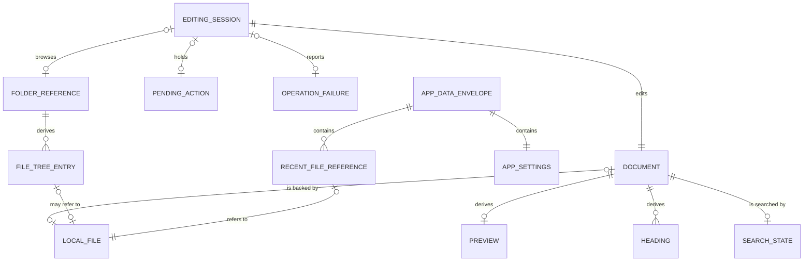

# 論理データモデル

## 状態

Initial baseline（2026-07-22）

## 目的と扱い

この文書は、Letteraの初期版で各機能が扱うデータ、その関係、正本、永続性、制約を定義する。機能ごとに似たデータを重複して持つことや、ユーザー文書とLettera固有データを混同することを防ぎ、後続の個別機能仕様と実装時のデータ設計の基準にする。

データベースのテーブル、JSONの具体的な構造、RustやTypeScriptの型、React stateの分割、ファイル名、保存ライブラリは決定しない。ここで示す属性は論理的に必要な情報であり、同じ形でメモリやファイルへ保持することを要求しない。

主要概念の見取り図は[概念データモデル](conceptual-data-model.md)、機能の入力・処理・出力は[機能定義](functions.md)、保存に関する判断は[ADR-0001](adr/0001-local-markdown-source-of-truth.md)と[ADR-0002](adr/0002-separate-app-state-storage.md)を正本とする。

## データの分類

| 分類 | 意味 | 主なデータ | アプリ終了後 |
| --- | --- | --- | --- |
| ユーザーの正本 | 利用者が所有し、Lettera以外からも扱える内容 | ローカルファイルの本文 | ローカルファイルとして残る |
| Lettera固有の永続データ | 利用体験を維持するためにLetteraが所有する状態 | アプリ設定、最近使った文書 | ユーザー文書とは別に残る |
| セッション状態 | 現在の編集や操作を進めるための一時状態 | 編集セッション、保留中の操作、操作失敗 | 原則として破棄する |
| 導出データ | 正本または現在の本文から再計算できる表示・索引 | プレビュー、見出し、検索結果、ファイルツリー | 正本として保存しない |

## 論理データ一覧

| ID | データ | 分類 | 正本／導出元 | 主な利用機能 |
| --- | --- | --- | --- | --- |
| DT-01 | Document | セッション状態 | Local file、または新規入力 | FN-01〜FN-03、FN-06〜FN-10、FN-24 |
| DT-02 | Local file | ユーザーの正本 | ローカルファイルシステム | FN-06〜FN-09 |
| DT-03 | Editing session | セッション状態 | 現在の操作 | FN-01〜FN-05、FN-10、FN-12、FN-15、FN-17、FN-22、FN-23 |
| DT-04 | App settings | Lettera固有の永続データ | Letteraのアプリデータ | FN-25〜FN-28 |
| DT-05 | Recent file reference | Lettera固有の永続データ | Letteraのアプリデータ | FN-18、FN-19、FN-30、FN-06 |
| DT-06 | Folder reference | セッション状態 | 利用者が選んだフォルダー | FN-20、FN-21 |
| DT-07 | File tree entry | 導出データ | Folder reference以下の現在の構成 | FN-21、FN-06 |
| DT-08 | Heading | 導出データ | Document.body | FN-16、FN-17 |
| DT-09 | Search state | セッション状態と導出データ | 検索文字列とDocument.body | FN-14、FN-15 |
| DT-10 | Preview | 導出データ | Document.body | FN-13 |
| DT-11 | Pending action | セッション状態 | 未保存の文書を置き換える操作 | FN-10、FN-07〜FN-09 |
| DT-12 | Operation failure | セッション状態 | 失敗したストア系機能 | FN-11、FN-29 |
| DT-13 | App data envelope | Lettera固有の永続データ | App settingsとRecent file reference | FN-18、FN-19、FN-25、FN-28 |

## データ間の関係

図中のLocal fileは、ファイルシステム上の対象を論理的に表す。Recent file referenceやFile tree entryが参照するファイルは、移動、削除、権限変更などによって実際には利用できない場合がある。

## DT-01 Document

現在編集中の一つの論理文書を表す。SourceとSplitは別のDocumentを持たず、同じDocumentを異なる方法で表示する。

| 属性 | 意味 | 制約 |
| --- | --- | --- |
| body | 現在編集中のプレーンテキストまたはMarkdown本文 | 入力内容を意図せず変換しない |
| file type | md、markdown、txtのいずれか | 新規文書はApp settingsのdefault file typeを使用する |
| format | plain textまたはMarkdownとしての扱い | file typeがmdまたはmarkdownならMarkdown、txtならplain text |
| file | 対応するLocal fileへの任意の参照 | 新規文書は保存に成功するまで持たない |
| display name | 利用者が文書を識別するための名称 | Local fileがない場合は名称未設定を表せる |

`display name`と`format`を本文とは別に永続化することを要求しない。保存済み文書ではファイル名や拡張子などから導出できる場合は重複して保持しない。新規文書は作成時点のデフォルトのファイルタイプを持ち、その後に設定値が変わっても作成済み文書のfile typeを変更しない。新規保存または別名保存で異なる対応拡張子が選ばれた場合は、保存成功後にDocumentのfile typeとformatを選ばれたファイルへ合わせる。

## DT-02 Local file

利用者が所有する保存済み文書の正本を表す。

| 属性 | 意味 | 制約 |
| --- | --- | --- |
| path | ローカルファイルシステム上の場所 | フロントエンドから受け取った値を信頼しない |
| name | 利用者へ表示するファイル名 | pathから導出できる場合は独立した正本にしない |
| file type | md、markdown、txtのいずれか | pathの拡張子から導出する |
| content | 保存済みのプレーンテキストまたはMarkdown | Lettera固有の設定や履歴を混入させない |

Lettera内にLocal fileの本文を別の永続データとして複製しない。編集中はDocument.bodyが未保存の作業状態になり、保存成功後にLocal fileのcontentと一致する。

## DT-03 Editing session

アプリ起動中の現在の作業状態を表す。

| 属性 | 意味 | 既定または制約 |
| --- | --- | --- |
| document | 現在編集中のDocument | 一つだけ |
| has unsaved changes | 正本へ未反映の変更があるか | 保存要求ではなく保存成功後にfalseとなる |
| view mode | SourceまたはSplit | 文書の内容を変更しない |
| toolbar visible | ツールバーの表示状態 | 本文から独立する |
| sidebar visible | サイドバーの表示状態 | 本文から独立する |
| selected folder | 現在参照するFolder reference | 任意 |
| cursor and selection | 現在の編集位置と選択範囲 | 本文との整合を保つ |

ツールバー、サイドバー、選択フォルダー、カーソル位置を再起動後も復元することは、現在の要件に含めない。

## DT-04 App settings

文書に依存せず、Lettera全体へ適用する設定を表す。

| 属性 | 意味 | 既定または制約 |
| --- | --- | --- |
| base font size | 本文編集へ適用する基本フォントサイズ | 正の有限値。具体的な範囲と既定値は未決定 |
| color scheme | アプリUIのカラーモード | system、light、darkのいずれか |
| default file type | 新規文書へ適用するファイルタイプ | md、markdown、txtのいずれか。既定値はmd |

保存値が存在しない、読み込めない、または制約を満たさない場合は、属性ごとに安全な既定値を使用する。設定の問題によってDocumentを読み書きできない状態にしない。

## DT-05 Recent file reference

最近利用したLocal fileを再び見つけるための参照を表す。文書の本文は保持しない。

| 属性 | 意味 | 制約 |
| --- | --- | --- |
| path | 対象Local fileへの参照 | 同じ対象を重複登録しない。利用時に検証する |
| last used at | 読込または新規保存に最後に成功した時点 | 一覧の順序を決められる時点情報 |

参照先が移動または削除されても、Recent file referenceが直ちに不正なデータになるとはみなさない。利用者が選んだ時点で読込を試み、失敗時は現在の文書を保持する。利用者は参照だけを一覧から除ける。自動的に削除するかは現時点では決めない。

## DT-06 Folder reference

ファイルツリーの起点として利用者が選んだローカルフォルダーへの参照を表す。

| 属性 | 意味 | 制約 |
| --- | --- | --- |
| path | 選択されたフォルダーの場所 | 利用時に検証する |
| name | 利用者へ表示する名称 | pathから導出できる場合は独立した正本にしない |

選択したフォルダーをアプリ再起動後も記憶することは、現在の要件に含めない。

## DT-07 File tree entry

Folder reference以下の現在の構成から導出する一つの項目を表す。

| 属性 | 意味 | 制約 |
| --- | --- | --- |
| path | ファイルまたはフォルダーの場所 | 選択されたFolder referenceの範囲内として扱う |
| name | 表示名 | pathから導出可能 |
| kind | fileまたはfolder | シンボリックリンクは当面含めない |
| parent | 親項目への任意の参照 | 起点の項目だけ持たない |

非表示ファイルとシンボリックリンクは当面File tree entryを生成しない。ファイルツリー全体を正本として保存せず、必要な時点のファイルシステムから再導出する。

## DT-08 Heading

Markdown本文から導出した一つの見出しを表す。

| 属性 | 意味 | 制約 |
| --- | --- | --- |
| text | 見出しとして表示する文字列 | Document.bodyから導出する |
| level | 見出し階層 | Markdownとして扱える範囲 |
| position | 対応する本文内の位置 | 本文変更後は再導出する |

HeadingをDocument.bodyとは別の正本として保存しない。同じ見出し文字列が複数存在することを許容し、文字列だけを識別子にしない。

## DT-09 Search state

現在の文書内検索と、その結果を表す。

| 属性 | 意味 | 制約 |
| --- | --- | --- |
| query | 利用者が入力した検索文字列 | 空の場合は未検索状態 |
| matches | 本文内の一致位置 | Document.bodyとqueryから導出する |
| active match | 現在参照している一致 | matchesが空の場合は持たない |

matchesの最後から次へ移動すると最初へ、最初から前へ移動すると最後へ循環する。本文またはqueryが変わった場合はmatchesとactive matchを再計算する。

## DT-10 Preview

Document.bodyをMarkdownとして解釈した表示結果を表す。

| 属性 | 意味 | 制約 |
| --- | --- | --- |
| rendered content | 表示可能なMarkdown変換結果 | 安全でない内容を利用者の環境を害する形で実行しない |

Previewを保存対象にせず、現在のDocument.bodyから再導出する。古い本文から導出した結果を、現在の本文のPreviewとして扱わない。

## DT-11 Pending action

未保存変更の確認または保存の間、利用者が最初に求めた操作を保持する。

| 属性 | 意味 | 制約 |
| --- | --- | --- |
| kind | new、open、close、quitのいずれか | 保存成功後に再開できる操作 |
| target | openの場合の任意の対象 | 利用時に再検証する |

保存成功後はPending actionを一度だけ実行して破棄する。保存失敗、保存先選択のキャンセル、未保存確認のキャンセルでは実行せず、現在のDocumentを保持する。

## DT-12 Operation failure

ストア系機能が完了しなかった結果と、回復に必要な情報を表す。

| 属性 | 意味 | 制約 |
| --- | --- | --- |
| operation | open、save、read folder、load settings、save settingsなど失敗した操作 | 再試行先を区別できる |
| category | 利用者の次の行動を判断するための失敗分類 | 内部エラー文字列へ依存しない |
| target | 失敗したファイル、フォルダー、またはアプリデータ | 表示前に安全な情報へ変換する |
| recoveries | 再試行、別の対象、編集継続などの候補 | 実行可能なものだけを示す |

内部的な詳細をそのまま利用者向けメッセージの正本にしない。Operation failureを永続化せず、現在の文書と編集内容を保持した状態で解消または破棄する。文書やフォルダーの操作失敗はFN-11、アプリ設定の読込・保存失敗はFN-29で回復する。

## DT-13 App data envelope

Lettera固有の永続データを、ユーザー文書と分離して読み書きする論理的なまとまりを表す。

| 属性 | 意味 | 制約 |
| --- | --- | --- |
| schema version | 保存された構造を読み継ぐための版 | 未知の版を無条件に現在の構造として扱わない |
| settings | 一つのApp settings | 欠落または不正な属性には既定値を使う |
| recent files | 0件以上のRecent file reference | 本文を含めない |

App data envelopeが単一ファイル、複数ファイル、またはライブラリ上のストアのどれに対応するかは決めない。読み込みや一部の値の検証に失敗しても、ユーザー文書の編集を妨げない。

## ワークセットごとのデータ利用

| ワークセット | 主な入力 | 更新する状態 | 導出するデータ | 永続化するデータ |
| --- | --- | --- | --- | --- |
| WS-01 すぐに書く | 文字入力、標準編集操作 | Document、Editing session | 未保存状態 | なし |
| WS-02 文書ライフサイクル | ファイル選択、保存先、終了要求 | Document、Editing session、Pending action、Operation failure | 未保存状態、表示名 | Local file |
| WS-03 Markdownを確認する | 表示モード、Document.body | Editing session | Preview | なし |
| WS-04 文書内を移動する | 検索文字列、見出し選択 | Search state、Editing session | 検索一致、Heading | なし |
| WS-05 文書を探す | 最近使った文書、Folder reference、項目選択 | Editing session、Operation failure | File tree entry | Recent file reference |
| WS-06 操作入口を統合する | コマンド、表示切替要求 | Editing session | 実行対象の操作 | なし |
| WS-07 表示設定を保つ | 設定変更 | App settings | 適用後の表示 | App settings |

## データ整合性の規則

1. 保存済み文書の正本はLocal fileのcontentだけとし、App data envelopeへ本文を複製しない。
2. Documentは同時に0または1個のLocal fileだけを参照する。
3. 新規文書は保存成功後に初めてLocal fileを参照する。
4. 保存に失敗した場合、Document.bodyと未保存状態を保持し、保存先や正本を成功したものとして更新しない。
5. Preview、Heading、Search stateのmatchesはDocument.bodyから再導出でき、独立した正本にしない。
6. Recent file referenceは本文を持たず、同じLocal fileへの参照を重複させない。
7. ファイル、フォルダー、最近使った文書のpathは利用時に検証し、存在やアクセス可能性を保存時点のまま信頼しない。
8. App settingsは一つとし、不正な属性だけを既定値へ置き換えられるようにする。
9. App data envelopeの失敗を、Local fileの読込・保存失敗やDocumentの破棄へ波及させない。
10. Pending actionは保存成功後に一度だけ実行し、元の操作が不明な状態で文書を置き換えない。
11. 新規文書のfile typeは作成時点のApp settingsから決定し、設定が欠落または不正な場合はmdを使用する。
12. 新規保存または別名保存でDocumentと異なる対応拡張子を選んだ場合、保存成功後にだけfile typeとformatを更新する。
13. Recent file referenceを除いても、参照先のLocal fileを削除、移動、または変更しない。

## 正規化と重複の扱い

- 文書本文はLocal fileと編集中のDocumentにだけ存在し、Preview、Heading、Recent file referenceへ複製しない。
- ファイル名、フォルダー名、文書の表示名はpathから導出できる場合、別の永続的な正本にしない。
- Headingと検索一致は位置を含め、同じ文字列が複数ある場合を区別する。
- File tree entryはFolder reference以下の現在の構成を表し、最近使った文書の履歴と兼用しない。
- App settingsは文書単位に複製せず、Lettera全体で一つとする。
- Recent file referenceは同じ対象を一件にまとめ、利用成功時点を更新する。

これはリレーショナルデータベースのテーブル正規化を要求するものではない。保存方式にかかわらず、正本の重複と更新時の不整合を避けるための論理的な規則である。

## 現段階で決めないこと

- path以外にLocal fileやFolder referenceを識別する値を持つか
- macOS上で同じファイルを表すpathの大文字小文字、シンボリックリンク、別名をどう同一視するか
- 未保存状態を内容比較、変更フラグ、版番号などのどれで判定するか
- 本文内の位置を文字オフセット、行と列、エディタ固有位置のどれで表すか
- App data envelopeの物理形式、ファイル名、保存場所、書き込み方式
- Recent file referenceの最大件数、自動削除、保存期間
- 基本フォントサイズの既定値、最小値、最大値、変更単位
- 保存時に拡張子がない、または対応外の拡張子が指定された場合の扱い
- テキスト以外のファイルをFile tree entryへ含めるか
- 外部アプリによるLocal fileの変更を検出・調停するためのデータ

これらは対応するPhaseへ着手し、実際のOS、ライブラリ、データ損失リスクを確認した時点で、個別機能仕様または必要に応じてADRで決定する。
