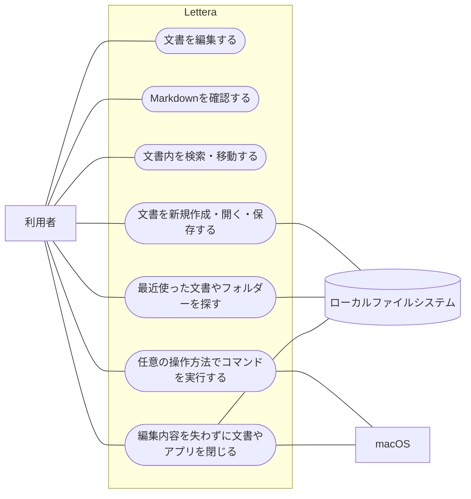

# 企画書

## プロジェクト名

Lettera

## なぜ

### プロダクトの目的

macOSで動作する軽量なエディターにより、思いついたアイデアなどを忘れないうちに素早く記録できるようにする。

### 開発の目的

Letteraの開発を通して、React、Tauri、Rustそれぞれの役割と連携を理解し、主要な処理を自分の言葉で説明できるようにする。アプリの完成だけでなく、実装過程で得た理解も成果として扱う。

## 何を

### 目的達成のためにつくるもの

- macOS向けの軽量なプレーンテキスト／Markdownエディター

### アプリの説明

Letteraは、思いついた内容をすぐに書き始められる、macOS向けの軽量なプレーンテキスト／Markdownエディターである。

テキストファイルを直接扱い、Markdownのプレビュー、文書のアウトライン、ファイルツリーなど、文章の作成と整理に必要な機能を提供する。

Typoraの編集体験に着想を得つつ、当面は個人利用に必要な機能に絞り、起動の速さと操作の単純さを重視する。

### 利用者

当面は開発者本人のみ。

### 利用者が得られる便益

利用者は、複雑な準備や操作をせず、思いついた内容をすぐに記録できる。

Markdownのプレビューや文書のアウトラインを利用することで、記法や文書構造を確認しながら文章を作成できる。

文書は一般的なテキストファイルとして保存されるため、特定のアプリに依存せず、ほかのツールでも利用できる。

### 初期版で実現すること

#### ユースケース図

図は初期版の利用目的をまとめたものである。「Markdownを確認する」にはプレビューとSource／Splitモードの切り替え、「文書内を検索・移動する」には検索とアウトラインによる移動、「任意の操作方法でコマンドを実行する」にはツールバー、キーボードショートカット、macOSメニューバーからの操作を含む。

各利用目的について、利用のきっかけから完了および例外までの流れは[利用者の行動シナリオ](user-action-scenarios.md)に記載する。

#### 文書の編集

- プレーンテキストを入力・編集できる
- 元に戻す、やり直す、コピー、切り取り、貼り付け、全選択ができる
- 文書内を検索できる
- Markdown文書をプレビュー表示できる
- Markdownソースだけを表示するSourceモードと、ソースとプレビューを横に並べるSplitモードを切り替えられる

#### ファイル操作

- 新しい文書を作成できる
- `.txt`や`.md`などのテキストファイルを開ける
- 編集中の文書をファイルへ保存できる
- 文書を別の名前や場所へ保存できる
- 最近開いたファイルを再度開ける
- 未保存の変更があることを確認できる
- 未保存の変更がある状態で文書やアプリを閉じる場合、保存するか確認できる
- ファイルの読み込みや保存に失敗した場合、利用者へ通知できる

#### 操作方法

- 保存などの主な操作をキーボードショートカットから実行できる
- 保存などの主な操作をmacOSのメニューバーから実行できる
- 保存などの主な操作をアプリのツールバーから実行できる
- ツールバーの表示・非表示を切り替えられる

#### サイドバー

- 編集領域の横にサイドバーを表示できる
- サイドバーの表示・非表示を切り替えられる
- Markdownの見出しを文書のアウトラインとして表示できる
- アウトラインから文書内の対応する箇所へ移動できる
- 指定したフォルダーのファイル構成をツリー表示できる
- ファイルツリーからテキストファイルを開ける

初期版の機能は一度に実装せず、[開発ロードマップ](roadmap.md)に沿って、仕組みを理解できる単位に分けて追加する。

### 将来実現したいこと

- Source、Splitに加えて、Markdownの記法とレンダリング結果を一つの編集画面に統合したSeamlessモードを追加する
- カーソルがある箇所ではMarkdown記法を編集でき、ほかの箇所では装飾された結果を表示する
- 画像、リンク、表などを編集画面内で自然に扱えるようにする

### 当面は対象としないこと

- 複数タブや複数ウィンドウでの編集
- 自動保存
- スペルチェック
- 文字コードや改行コードの選択
- 印刷やPDFへの出力
- テーマやフォントの詳細なカスタマイズ

## 判断の優先順位

要件や実装方法に迷った場合は、次の順序を優先する。

1. 利用者の既存ファイルと編集中の内容を失わせないこと
2. 思いついた内容を素早く記録できる単純な操作であること
3. 一般的なテキスト／Markdownファイルとの互換性を保つこと
4. 開発者が仕組みを理解し、説明できること
5. 機能数を増やすこと

## どのように

### 体制

開発者本人のみ

### 期限

特に無し
