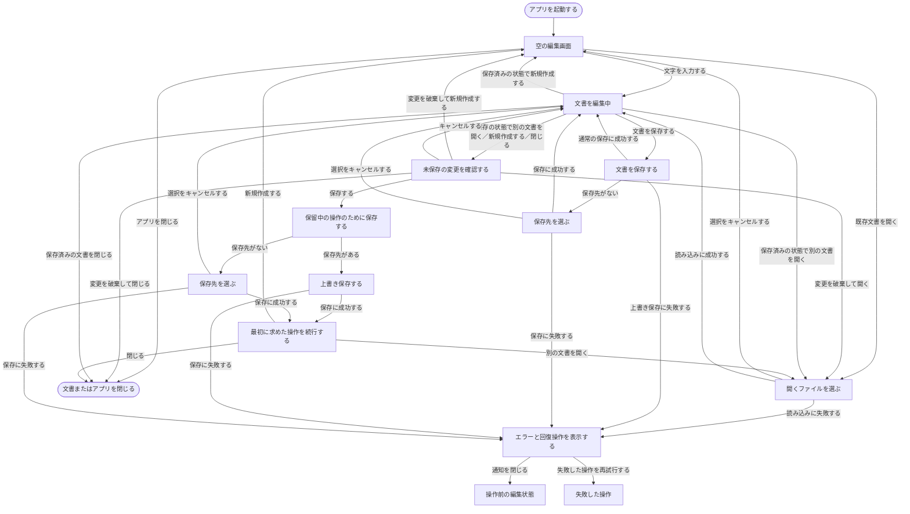

# UI設計

## 状態

Initial baseline（2026-07-22）

## 目的と扱い

この文書は、Letteraの初期版で利用者が触れるUI、その間の動線、各UIで必要になる情報と状態を整理するためのラフな設計である。実装前に利用者の行動を画面へ対応付け、必要な操作や例外状態の見落としを減らすことを目的とする。

寸法、色、フォント、正確な文言、Reactコンポーネントの分割は決定しない。図とラフは配置の方向性を共有するためのものであり、完成画面を指定するものではない。実装を進めて前提が変わった場合は、この文書も更新する。

プロダクトの目的と初期版の範囲は[企画書](proposal.md)、具体的なUIを決める前の利用者の目的と行動は[利用者の行動シナリオ](user-action-scenarios.md)、UIから呼び出す処理と出力は[機能定義](functions.md)、機能を実装する順番は[開発ロードマップ](roadmap.md)、個別機能から観察できる振る舞いと受け入れ条件は`features/`以下の仕様を正本とする。この文書にはそれらを複製せず、UI間の関係と画面上の表現を中心に記録する。

## UI設計の原則

- 起動後、ファイル操作をしなくてもすぐに書き始められる。
- 編集中の内容と未保存状態を、画面やモードの切り替えによって失わせない。
- 同じコマンドをツールバー、キーボードショートカット、macOSメニューバーから実行できる場合も、結果は一貫させる。
- ファイル操作に失敗した場合は編集中の内容を保持し、利用者が次に取れる操作を示す。
- 頻繁に使う編集領域を中心に置き、ツールバー、サイドバー、通知が文章の入力を不必要に妨げないようにする。
- macOSが提供する標準的なファイル選択、保存、終了操作と矛盾しないようにする。

## 対象となるUI

ここでいうUIは実装上のコンポーネントではなく、利用者にとって一つの目的を持つ画面、領域、ダイアログを指す。

| ID | UI | 目的 | 主な状態 | 関連シナリオ |
| --- | --- | --- | --- | --- |
| UI-01 | エディタ画面 | 文書を入力・編集する | 空、編集中、未保存、保存済み | AS-01、AS-03 |
| UI-02 | Markdownプレビュー | Markdownの表示結果を確認する | 非表示、表示、変換結果 | AS-05 |
| UI-03 | ツールバー | 主なコマンドを画面から実行する | 表示、非表示、操作可能、操作不可 | AS-11 |
| UI-04 | サイドバー | 文書やファイルを探して移動する | 非表示、アウトライン、ファイルツリー | AS-07、AS-09 |
| UI-05 | 文書内検索 | 現在の文書から文字列を探す | 未入力、該当あり、該当なし | AS-06 |
| UI-06 | ファイル選択・保存先選択 | 開くファイルまたは保存先を選ぶ | 選択、キャンセル | AS-02、AS-03、AS-09 |
| UI-07 | 未保存変更の確認 | 編集内容を失う可能性のある操作を確認する | 保存、破棄、キャンセル | AS-04 |
| UI-08 | エラー通知 | 失敗した操作と回復方法を伝える | 読み込み失敗、保存失敗、参照先なし | AS-10 |
| UI-09 | 最近使った文書 | 過去に開いた、または新規保存した文書を再び選ぶ | 履歴あり、履歴なし、参照先なし | AS-08 |
| UI-10 | 設定 | 表示設定を確認・変更する | 既定値、変更済み、読込失敗 | AS-12 |

## 全体の動線

図中の「編集画面」はUI-01を中心に、必要に応じてUI-02からUI-05を組み合わせた状態を表す。ファイル選択と保存先選択は、macOSの標準ダイアログを利用する想定で一つのUIとして扱う。



この図では主要な分岐を示すことを優先し、最近使ったファイルやファイルツリーから文書を開く入口は省略している。どの入口から開いても、未保存確認、読み込み、成功または失敗という結果は同じである。

## UI-01 エディタ画面

### 目的

アプリを起動した利用者がすぐに文章を書き始め、現在の文書と保存状態を確認できるようにする。編集領域はSourceモードとSplitモードで同じ論理文書を扱う。

### ラフ

```text
┌──────────────────────────────────────────────────────────┐
│ ツールバー（表示時）                                     │
│ [新規] [開く] [保存]       [Source | Split] [検索] [☰]  │
├──────────────┬─────────────────────┬─────────────────────┤
│ サイドバー   │ Source editor       │ Preview             │
│ （表示時）   │                     │ （Split時のみ）      │
│              │ # タイトル          │ タイトル            │
│ アウトライン │                     │                     │
│ または       │ 本文を入力する…     │ 表示結果            │
│ ファイル     │                     │                     │
│ ツリー       │                     │                     │
├──────────────┴─────────────────────┴─────────────────────┤
│ 文書名または「名称未設定」                    未保存     │
└──────────────────────────────────────────────────────────┘
```

ツールバーまたはサイドバーを非表示にした場合、その領域は編集領域へ戻す。Sourceモードではプレビュー領域を表示せず、Source editorが残りの領域を使う。

### 表示する情報

- 編集中の本文
- 文書名。保存先がない場合は名称未設定であること
- 未保存の変更の有無
- 現在の表示モード（SourceまたはSplit）
- 必要に応じて、ツールバー、サイドバー、検索UI、エラー通知

### 可能な操作

- 本文の入力と通常のテキスト編集
- 新規文書の作成、既存文書を開く、保存、別名保存
- SourceとSplitの切り替え
- 文書内検索の開始
- ツールバーとサイドバーの表示切り替え
- サイドバーのアウトラインまたはファイルツリーから対象へ移動

### 主な状態

| 状態 | 本文 | 保存先 | 未保存表示 | 主な意味 |
| --- | --- | --- | --- | --- |
| 新規・空 | 空 | なし | なし | 起動直後または新規作成直後 |
| 新規・編集中 | あり | なし | あり | 初回保存には保存先の選択が必要 |
| 既存・保存済み | あり得る | あり | なし | 表示中の内容と保存済み内容が一致 |
| 既存・編集中 | あり得る | あり | あり | 上書き保存または別名保存が可能 |

## UI-02 Markdownプレビュー

### 目的

Markdown本文を変更せずに、その表示結果を編集と並行して確認できるようにする。

### 必要な振る舞い

- SplitモードでSource editorの横に表示する。
- Source editorと同じ本文から表示結果を導出する。
- SourceとSplitを切り替えても本文と未保存状態を保持する。
- Markdownとして解釈できない部分があっても、編集できる元の本文を失わせない。

プレビューの更新タイミング、スクロール同期、SourceとPreviewの幅は現時点では決めない。

## UI-03 ツールバー

### 目的

頻繁に使う主なコマンドを、メニューやショートカットを覚えていなくても実行できるようにする。

### 候補となる項目

- 新規作成
- 開く
- 保存
- Source／Splitの切り替え
- 文書内検索
- サイドバーの表示切り替え

別名保存、ツールバー自体の表示切り替え、編集の標準操作をツールバーへ置くかは現時点では決めない。項目数を増やす場合も、文章を書くための領域を圧迫しないことを優先する。

## UI-04 サイドバー

### 目的

現在の文書内の位置、またはローカルフォルダー内の文書を見つけて移動できるようにする。

### ラフ

```text
┌──────────────────────┐
│ [アウトライン|Files] │
├──────────────────────┤
│ アウトライン時       │
│ タイトル             │
│   セクション1        │
│   セクション2        │
│                      │
│ ファイルツリー時     │
│ ▾ notes              │
│   ├ memo.md           │
│   └ ideas.txt         │
└──────────────────────┘
```

### 必要な振る舞い

- 表示と非表示を切り替えられる。
- アウトラインではMarkdown本文から導出した見出しを表示する。
- 見出しを選ぶと、Source editorの対応箇所へ移動する。
- ファイルツリーでは指定したフォルダー以下の構成を表示する。
- 対応するテキストファイルを選ぶと、その文書を開く動線へ進む。
- 参照先が存在しない、または読み込めない場合はUI-08で伝える。

アウトラインとファイルツリーをタブ、セグメント、別の操作のどれで切り替えるかは現時点では決めない。

## UI-05 文書内検索

### 目的

現在編集中の文書から文字列を探し、一致箇所へ移動できるようにする。

### ラフ

```text
┌────────────────────────────────────┐
│ 検索: [検索文字列             ] 2/5│
│                         [前] [次] ×│
└────────────────────────────────────┘
```

### 必要な状態

- 検索語が未入力
- 一致箇所が一件以上あり、現在位置と総数を確認できる
- 一致箇所がない

大文字と小文字の区別、正規表現、置換は初期版の要件に含めない。

## UI-06 ファイル選択・保存先選択

### 目的

利用者がローカルファイルシステムから開く文書、または文書の保存先を選択できるようにする。

### 必要な振る舞い

- macOSの標準的な選択方法を利用する。
- ファイル選択では対象となるテキストファイルを選べる。
- 保存先選択ではファイル名と保存場所を指定できる。
- キャンセルは失敗として通知せず、元の編集状態へ戻る。
- 選択後の読み込みや保存が失敗した場合も、編集中の本文を保持する。

具体的な拡張子フィルター、初期表示フォルダー、上書き確認をLetteraとmacOSのどちらが担うかは、ファイル操作へ着手するときに決める。

## UI-07 未保存変更の確認

### 目的

未保存の変更を失う可能性がある操作を続ける前に、保存、破棄、キャンセルを選べるようにする。

### ラフ

```text
┌──────────────────────────────────────────┐
│ 「memo.md」の変更を保存しますか？        │
│                                          │
│ 保存しない場合、変更内容は失われます。   │
│                                          │
│ [キャンセル] [保存しない] [保存]         │
└──────────────────────────────────────────┘
```

### 必要な振る舞い

- 対象文書を識別できる名称を表示する。
- 保存を選んだ場合、保存が成功するまで元の操作を完了しない。
- 保存に失敗した場合、文書を閉じたり別の文書で置き換えたりしない。
- 破棄は編集内容を失う操作であることを明確にする。
- キャンセルは確認を始める前の編集状態へ戻る。

## UI-08 エラー通知

### 目的

操作が完了しなかったこと、編集中の内容がどうなっているか、利用者が次に何をできるかを伝える。

### ラフ

```text
┌──────────────────────────────────────────┐
│ 文書を保存できませんでした               │
│ 編集中の内容はLetteraに残っています。    │
│                                          │
│ [閉じる] [別の場所へ保存] [再試行]       │
└──────────────────────────────────────────┘
```

### エラーごとに必要な情報

| 失敗した操作 | 利用者へ伝えること | 候補となる回復操作 |
| --- | --- | --- |
| ファイルを開く | 選んだ文書を開けなかった | 閉じる、再試行、別の文書を選ぶ |
| ファイルを保存する | 保存が完了しておらず、編集内容は保持されている | 再試行、別名保存、閉じる |
| 最近使ったファイルを開く | 参照先が移動または削除された可能性がある | 一覧から除く、別の文書を選ぶ |
| フォルダーを読み込む | ファイルツリーを表示できなかった | 再試行、別のフォルダーを選ぶ |

内部的なエラー文字列をそのまま表示せず、利用者が状況を判断するために必要な範囲へ言い換える。通知をモーダル、シート、画面内メッセージのどれで表すかは、操作を止める必要性に応じて各機能の実装時に決める。

## UI-09 最近使った文書

### 目的

利用者が、以前Letteraで開いた、または新規保存した文書をファイルの場所から探し直さずに選べるようにする。

### ラフ

```text
┌──────────────────────────────────────┐
│ 最近使った文書                       │
├──────────────────────────────────────┤
│ memo.md          ~/Documents/notes   │
│ ideas.txt        ~/Documents         │
│ meeting.md       ~/work/project      │
└──────────────────────────────────────┘
```

### 必要な振る舞い

- 文書を識別できる名前を表示する。
- 同名の文書を区別する必要がある場合は、保存場所も確認できるようにする。
- 文書を選ぶと、既存文書を開く動線へ進む。
- 現在の文書に未保存の変更がある場合は、UI-07へ進む。
- 参照先が移動、削除、または読み込み不能の場合はUI-08で伝え、現在の文書を保持する。
- 利用者は文書の参照を一覧から除ける。この操作が参照先のファイルを削除しないことを明確にする。
- 履歴がない場合は、最近使った文書がないことを示す。

最近使った文書への入口、表示件数、除く操作の具体的な見せ方、履歴の保存期間は現時点では決めない。並び順は最近利用した順とする。

## UI-10 設定

### 目的

利用者が、本文の基本フォントサイズとアプリUIのカラーモードを確認・変更できるようにする。

### ラフ

```text
┌──────────────────────────────────────────┐
│ 設定                                     │
├──────────────────────────────────────────┤
│ 基本フォントサイズ  [ − ] 16 [ ＋ ]     │
│                                          │
│ カラーモード                             │
│ (●) システム設定に従う                   │
│ ( ) ライト                               │
│ ( ) ダーク                               │
│                                          │
│ デフォルトのファイルタイプ               │
│ [Markdown (.md)                      ▾]  │
└──────────────────────────────────────────┘
```

### 必要な振る舞い

- 現在適用されている基本フォントサイズを確認できる。
- 利用可能な範囲で基本フォントサイズを変更できる。
- カラーモードを、システム設定に従う、ライト、ダークから一つ選べる。
- デフォルトのファイルタイプを、Markdown（`.md`）、Markdown（`.markdown`）、Plain Text（`.txt`）から一つ選べる。
- 変更した設定を現在の画面へ反映する。
- アプリの再起動後も保存済みの設定を画面と新しく作成する文書へ反映する。
- 設定を読み込めない場合は安全な既定値を使い、文書を編集できる状態で起動する。

設定を独立した画面、シート、またはmacOSの設定ウィンドウのどれで表すか、フォントサイズを数値入力と段階的な選択のどちらで変更するかは現時点では決めない。

## 文書ライフサイクルの状態遷移

| 現在の状態 | 利用者の操作 | 条件 | 結果 | キャンセルまたは失敗時 |
| --- | --- | --- | --- | --- |
| 新規・空 | 文字を入力する | — | 新規・編集中になる | — |
| 新規・編集中 | 保存する | 保存先なし | 保存先選択を表示する | 本文と未保存状態を保持する |
| 既存・保存済み | 文字を編集する | — | 既存・編集中になる | — |
| 既存・編集中 | 保存する | 保存先あり | 成功後、既存・保存済みになる | 本文と未保存状態を保持する |
| 任意 | 別名保存する | — | 保存先選択を表示する | 元の文書状態を保持する |
| 未保存 | 新規作成する | — | 未保存変更の確認を表示する | キャンセル時は元の文書へ戻る |
| 未保存 | 別の文書を開く | — | 未保存変更の確認を表示する | キャンセル時は元の文書へ戻る |
| 未保存 | 文書またはアプリを閉じる | — | 未保存変更の確認を表示する | キャンセル時は元の文書へ戻る |
| 保存済み | 新規作成する | — | 新規・空になる | — |
| 保存済み | 別の文書を開く | — | ファイル選択を表示する | キャンセルまたは失敗時は元の文書を保持する |
| 保存済み | 文書またはアプリを閉じる | — | 閉じる | — |

## 操作と入口の対応

同じ操作に複数の入口を設ける場合、入口ごとに別の振る舞いを定義しない。

| 操作 | ツールバー | ショートカット | macOSメニュー | その他の入口 |
| --- | --- | --- | --- | --- |
| 新規作成 | あり | あり | あり | — |
| 開く | あり | あり | あり | 最近使ったファイル、ファイルツリー |
| 保存 | あり | あり | あり | — |
| 別名保存 | 未決定 | あり | あり | — |
| 文書内検索 | あり | あり | あり | — |
| Source／Split切り替え | あり | 未決定 | 未決定 | — |
| サイドバー表示切り替え | あり | 未決定 | あり | — |
| ツールバー表示切り替え | 対象外 | 未決定 | あり | — |

ショートカットの具体的なキー、メニュー階層、アイコンは、macOSの慣習と衝突しないことを確認した上でPhase 6で決める。

## 未決事項

- アプリ起動時に常に空の新規文書を表示するか、前回の文書や最近使った文書を提示するか
- ウィンドウタイトル、ステータス領域、未保存マークをどのように組み合わせるか
- Source／Split切り替えの操作形式と、Split時の初期幅
- プレビューとSource editorのスクロールを同期するか
- アウトラインとファイルツリーの切り替え方法
- 最近使ったファイルをサイドバー、メニュー、起動画面のどこへ配置するか
- エラー通知を操作ごとにモーダル、シート、画面内メッセージのどれで表すか
- 保存成功を明示的に通知するか、未保存表示の解除だけで示すか
- VoiceOver、キーボードフォーカス、コントラストなどのアクセシビリティ要件の詳細
- 基本フォントサイズの既定値、最小値、最大値、変更単位

これらは見た目だけで決めず、関連する機能へ着手した時点で、利用者の行動、データ損失の可能性、macOSの慣習を踏まえて判断する。
